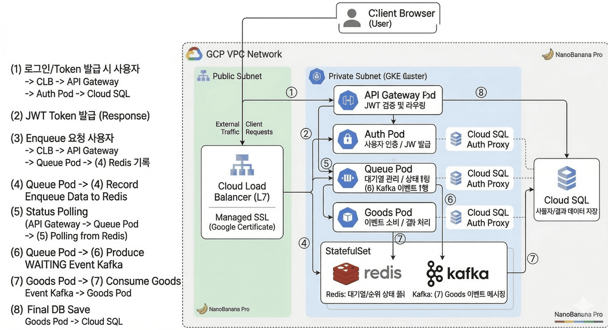



### 장애를 인프라 레이어 단위로 분해하여 원인을 분석하는 클라우드 엔지니어 윤여찬입니다!

## Skills

## Programming Languages

## Tool

## Studying

## GitHub Stats

  
  

## 주요 프로젝트

### 실시간 대기열 분산 처리 시스템 인프라 설계 및 운영 (2026.01~2026.03)

  

**주요 기여 내용**

- GCP 프리티어 환경에서 대규모 트래픽 병목 해결을 위해 Kafka와 Redis 기반 비동기 대기열 시스템을 Kubernetes 인프라에 구축하여 실패율을 최소화했습니다.
  MAU 2000 기준 동시 접속 부하 테스트에서 434,384건 중 1건 수준으로, 0%에 가까운 실패율을 달성했습니다.
- Terraform 기반 IaC로 GCP 인프라 프로비저닝을 자동화해 인프라 재사용성과 일관성을 높이고 프로비저닝 시간을 단축했습니다.
  기존 약 1.5~2시간이 걸리던 작업을 약 20분으로 줄였습니다.
- 응답 속도와 처리량 향상을 위해 GKE 기반 오토스케일링(HPA) 및 리소스 최적화를 수행했습니다.
  MAU 2000 기준 동시 접속 부하 테스트에서 최대 716 RPS, p95 305ms 성능을 확보했습니다.
- Static IP 점유로 인한 LB 생성 실패 문제를 Cloudflare Ingress Service Pod 레이어 순서로 원인을 분해 분석하여 해결했습니다.

**Reference**

- [GitHub - yourssu/backend-morupark](https://github.com/yourssu/backend-morupark)
- [인프라는 크레페 케이크다](https://medium.com/@ducks.urssu/%EC%9D%B8%ED%94%84%EB%9D%BC%EB%8A%94-%ED%81%AC%EB%A0%88%ED%8E%98-%EC%BC%80%EC%9D%B4%ED%81%AC%EB%8B%A4-f462841566e3)

## 경력 사항

### 가우스랩 인프라 운영 인턴 (2025.06~08)

**주요 기여 및 해결 경험**

1. **연차 관리 페이지 404 장애 해결**
   애플리케이션 레이어에 한정하지 않고 Nginx 및 인프라 레이어로 원인을 확장 분석해, Nginx 이중 프록시 설정 충돌 해소와 SPA 경로(`try_files`) 최적화로 서비스를 정상 복구했습니다.
2. **80 포트 차단 문제 해결 (VPN + 리버스 프록시)**
   통신사 정책으로 차단된 80 포트 문제를 해결하기 위해 Oracle Cloud + WireGuard 기반 터널링 우회 경로를 구축하고, `iptables`/`ufw` 충돌을 정리해 접근을 정상화했습니다.
3. **모바일사업부 페이지 접속 불가 문제 해결**
   SSL 인증서 만료, 포트 충돌, Docker 네트워크 문제 등 복합 장애를 단계적으로 분석하여 프로토콜 조정 및 백엔드 포트 재매핑으로 API와 DB 연결을 정상화했습니다.

**Reference**

- [시리즈 | 인턴 일기 - anozanami.log](https://velog.io/@anozanami/series/%EC%9D%B8%ED%84%B4-%EC%9D%BC%EA%B8%B0)

